# 4.airflow scheduling sil-test guide

### 1、Download ndas & drivesim & davt docker image

```bash

docker login artifact.swf.daimler.com
docker pull artifact.swf.daimler.com/adasndas-docker/sil3/r5_containers/ndas:ndas_22_11_4b    
docker pull artifact.swf.daimler.com/adasndas-docker/sil3/r5_containers/ds:ds13_r5_1_final   
docker pull artifact.swf.daimler.com/adasdai-docker/davt/davt:v0.40.0           
```

#### view releated mirror:

```bash

docker images

REPOSITORY                                                         TAG               IMAGE ID       CREATED        SIZE
mysql                                                              5.7               dd6675b5cfea   2 weeks ago    569MB
artifact.swf.daimler.com/adasndas-docker/sil3/r5_containers/ndas   ndas_22_11_4b     ccb4f97fdbe1   7 weeks ago    23.2GB
artifact.swf.daimler.com/adasndas-docker/sil3/r5_containers/ds     ds13_r5_1_final   c0c14b7572ae   7 weeks ago    33.6GB
artifact.swf.daimler.com/adasdai-docker/davt/davt                  v0.40.0           fe473a63530e   2 months ago   2.85GB

```

### 2、Create siltest user and user group

```bash
groupadd  --gid 1001 siltest
useradd --gid 1001 --uid 1001 siltest
```

### 3、Create dags and related scripts

```bash
# The airflow scheduling task script needs to be placed in the dags directory, so this directory must be created
cd /data/airflow
mkdir dags
```

```bash
cd dags
# Download relevant scripts from git to this directory
ls  -al 
multi_ndas_drivesim_airflow.py
single_ndas_drivesim_airflow.py
```

### 4、Create siltest working directory and related dependent files

```bash
# 1.Create script and cache directory
mkdir -p /data/siltest/{script,cache,rrLog}
mkdir -p /data/siltest/cache/dockerovcache-dev
cd /data/siltest
# 2.Go to /data/siltest/script, download or copy the relevant scripts to this directory
# 3. chmod 777 -R /data/siltest/script
# 4.Copy or download digital-testing-product to /data/siltest directory
# The final directory structure under /data/siltest is as follows:
	digital-testing-product    # Need to copy or download
	cache                      # need to create
	rrLog                      # need to create
	script                     # need to create
	silBackup                  # The script will automatically generate a backup directory
	silEvaluationInput         # The script will automatically generate the evaluation report input directory
	silEvaluationOutput        # The script will automatically generate the evaluation report output directory
```

#### The script under /data/siltest/script is as follows:

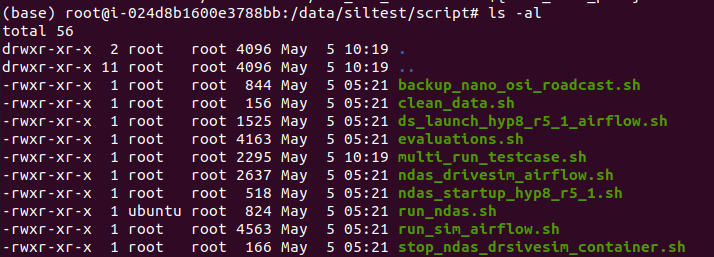

#### The content of /data/siltest/silBackup is as follows:

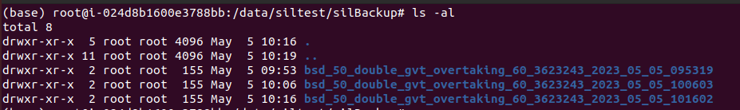

#### The contents of /data/siltest/silEvaluationOutput are as follows:

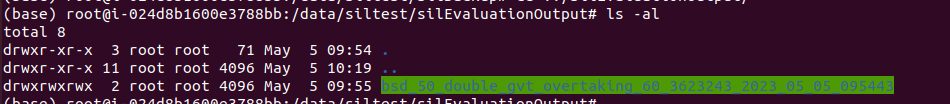

#### The contents of /data/siltest/silEvaluationInput are as follows:

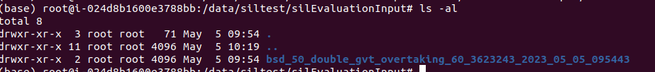

### 5、Browser access airflow and add variables

```
Browser access to airflow
http://127.0.0.1:18080/home
Enter username and password to log in
Click the switch button to activate the DAGS task, as shown below:
```

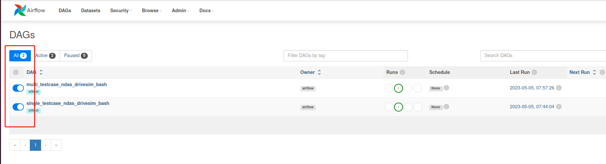

#### add variable

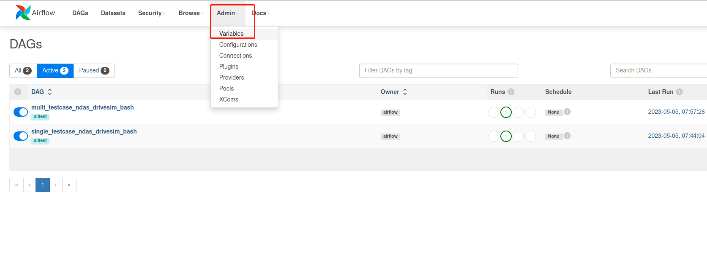

### Click Variables under Admin, and add variables in turn as follows

```
Key: docker_host
Val: 127.0.0.1

Key: drivesim_image
Val: artifact.swf.daimler.com/adasndas-docker/sil3/r5_containers/ds:ds13_r5_1_final

Key: ndas_image
Val: artifact.swf.daimler.com/adasndas-docker/sil3/r5_containers/ndas:ndas_22_11_4b


Key: omniverse_ip
Val: 10.229.0.223

Key: siltest_dir
Val: /data/siltest

Note: single case path
Key: single_case_path  
Val: /drivesim-ov/testcase_assets/scenarios/blind_spot_monitoring_bsm/china_bsm_gbt/doubleside/bsd_50_double_gvt_overtaking_60_3623243.xebtb

Note: Multiple case serial execution paths, multiple paths must be separated by ;, and there should be no spaces in between, it is a continuous string, the example is as follows Val
Key: multi_test_case_path
Val: /drivesim-ov/testcase_assets/scenarios/blind_spot_monitoring_bsm/china_bsm_gbt/doubleside/bsd_50_double_gvt_overtaking_60_3623243.xebtb;/drivesim-ov/testcase_assets/scenarios/blind_spot_monitoring_bsm/china_bsm_gbt/doubleside/bsd_50_double_gvt_overtaking_60_3623243.xebtb;
```

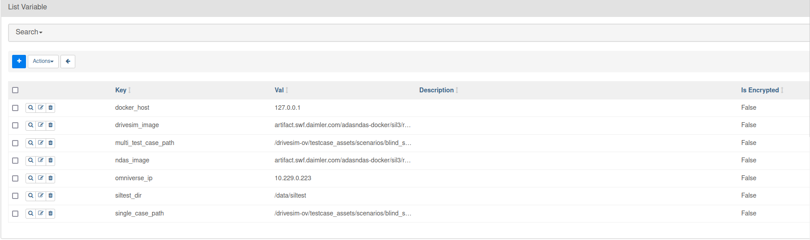


### 6、Click on dags to trigger execution tasks

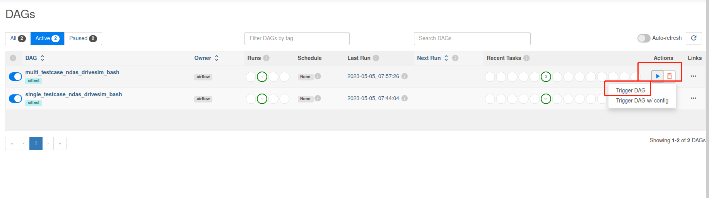

### 7、Single testcase task process

The flow chart is as follows:

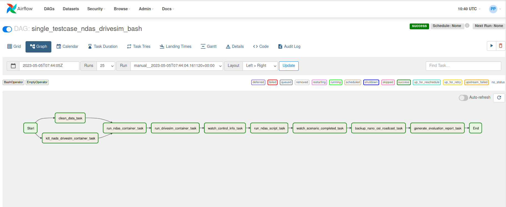

### 8、Multiple testcase serial task process

The flow chart is as follows:

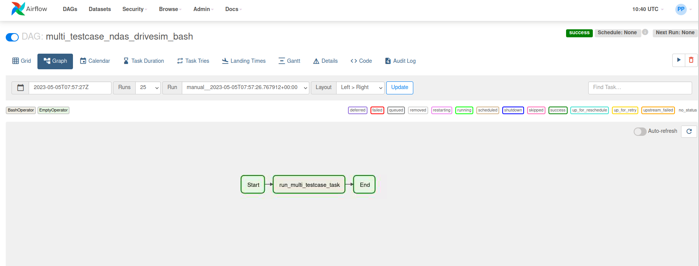

### 9、View task node status

Click Grid or Graph to view the execution status of each task. Green indicates successful execution.

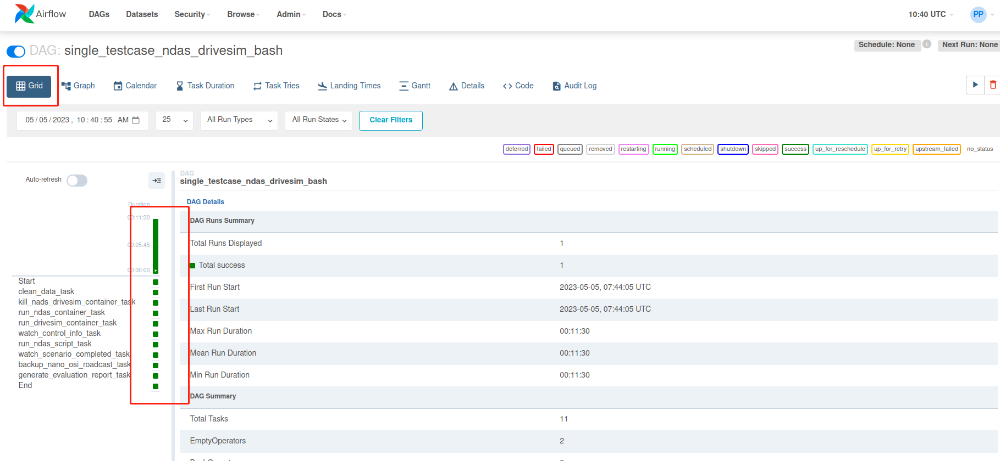

Click on the task node , and the task execution Logs will be displayed on the right, as shown in the figure below

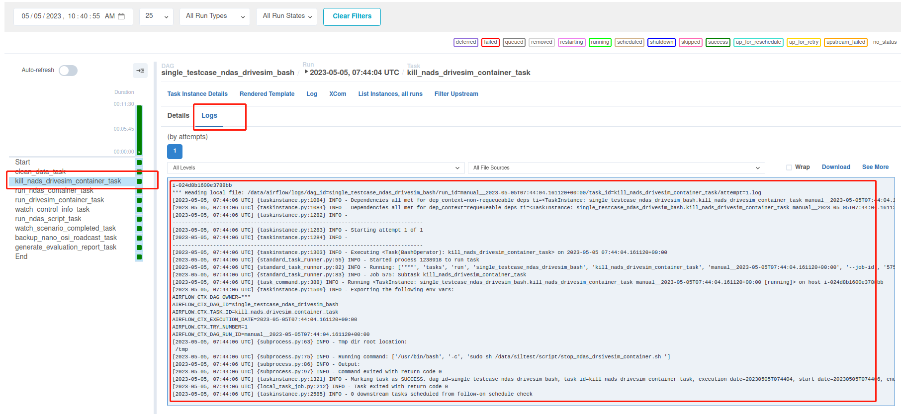

### 10、Script usage description

Airflow task scheduling needs to rely on the following scripts to run, and the default path is under /data/siltest/script

```
# Back up the log, csv, and osi files generated by drivesim and ndas, and package and back up the entire rrLog, and will be named after the xebtb name of the testcase
backup_nano_osi_roadcast.sh    
# Before each task is executed, the rrlog and cache directories need to be cleaned up
clean_data.sh
# Run the drivesim-ov container
ds_launch_hyp8_r5_1_airflow.sh
# Find files according to /data/siltest path and testcase path and generate evaluation report
evaluations.sh
# Serial execution of multiple testcases
multi_run_testcase.sh
# run ndas container
ndas_startup_hyp8_r5_1.sh
# run_ndas script in mount ndas container
run_ndas.sh
# When running the drivesim-ov container, run_sim and testcase are automatically executed
run_sim_airflow.sh
# Stop ndas, drivesim-ov container
stop_ndas_drsivesim_container.sh
```

